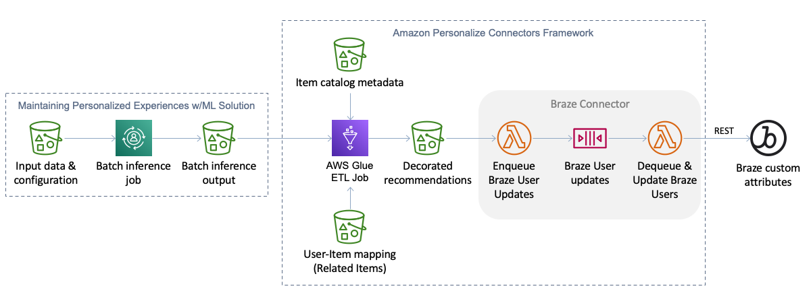

# Amazon Personalize Connectors

This project provides a connector framework that provides a general purpose ETL pipeline for consuming output from Amazon Personalize batch inference jobs, decorating recommended itemId's from Personalize with rich item metadata needed to render them in customer-facing tools/applications, and sending the decorated output to a supported downstream destination. Currently the only supported destination is the [Braze](https://www.braze.com/) customer engagement platform. Additional destinations can be easily plugged into this framework.



## Batch Inference

This solution builds upon the automation of batch inference jobs provided in the [Maintaining Personalized Experiences with Machine Learning](https://aws.amazon.com/solutions/implementations/maintaining-personalized-experiences-with-ml/) solution. That is, you must deploy that solution before deploying this solution and the ouput of batch inference jobs from that solution is used as input for this solution.

The [Maintaining Personalized Experiences with Machine Learning](https://aws.amazon.com/solutions/implementations/maintaining-personalized-experiences-with-ml/) solution maintains its own S3 bucket where batch inference job input and output files are stored. The S3 bucket layout looks something like this (please consult the solution documentation for more details).

```
batch/
│
└── <personalize_dataset_group_name>/
    └── <personalize_solution_name>/
        └── job_config.json
        └── <personalize_solution_name_YYYY_MM_DD_HH_MM_SS>/
            ├── _CHECK
            └── job_config.json.out
```

This solution is designed to take in the output files from batch inference jobs that are processed by the above solution. This solution has its own S3 bucket for job inputs and outputs. Here is the layout of the S3 bucket.

```
etl_jobs/
│
└── related_items/
    └── <job_name>/
        └── config.json
        └── input/
            └── user_item_mapping/
                └── <user_item_mapping_part_1>.csv
                └── <user_item_mapping_part_2>.csv
                └── <user_item_mapping_part_n>.csv
            └── item_metadata/ (optional)
                └── <item_metadata_part_1>.json
                └── <item_metadata_part_2>.json
                └── <item_metadata_part_n>.json
        └── output/
            └── <connector_type_1>/
                └── state/
                └── year=<YYYY>/
                    └── month=<MM>/
                        └── day=<DD>/
                            └── time=<HHMMSS>/
            └── <connector_type_2>/
                └── state/
                └── year=<YYYY>/
                    └── month=<MM>/
                        └── day=<DD>/
                            └── time=<HHMMSS>/
            └── <connector_type_n>/
                └── state/
                └── year=<YYYY>/
                    └── month=<MM>/
                        └── day=<DD>/
                            └── time=<HHMMSS>/
│
└── user_personalization/
    └── <job_name>/
        └── config.json
        └── input/
            └── item_metadata/ (optional)
                └── <item_metadata_part_1>.json
                └── <item_metadata_part_2>.json
                └── <item_metadata_part_n>.json
        └── output/
            └── <connector_type_1>/
                └── state/
                └── year=<YYYY>/
                    └── month=<MM>/
                        └── day=<DD>/
                            └── time=<HHMMSS>/
            └── <connector_type_2>/
                └── state/
                └── year=<YYYY>/
                    └── month=<MM>/
                        └── day=<DD>/
                            └── time=<HHMMSS>/
            └── <connector_type_n>/
                └── state/
                └── year=<YYYY>/
                    └── month=<MM>/
                        └── day=<DD>/
                            └── time=<HHMMSS>/
```

There are currently two batch inference job types supported by this solution: related items and user_personalization. Personalized ranking job types may be added in the future.

To create a connector pipeline job flow, follow these steps.

1. Create a job configuration file and upload it to the connector bucket created in your account by this solution when it is deployed. This file must be named `config.json` and it must be placed under the `etl_jobs/<job_type>/<job_name>/` where `<job_type>` is either "related_items" or "user_personalization" and `<job_name>` is defined by you.
    - The `config.json` file must have "batchInferencePath" and at least one connector declared under "connectors". See the [sample](./sample/config.json) for an example.
    - The "batchInferencePath" field value must be the S3 path to a batch inference job output location in the Maintaining Personalized Experiences with Machine Learning solution.
2. If you want the ETL pipeline to decorate the recommended items with item metadata of your choice, upload your item metadata file(s) to the `etl_jobs/<job_type>/<job_name>/input/item_metadata/` folder corresponding to the `<job_type>` and `<job_name>` defined in the prior step.
3. If the `<job_type>` is "related_items", you must provide user-item mapping file(s) so that the ETL pipeline can attribute related item recommendations back to a specific user. The user-item mappings file(s) should be in CSV format with USER_ID and ITEM_ID columns.
4. From the [AWS Glue console](https://console.aws.amazon.com/glue/home) in the AWS account and region where you deployed this solution or via the AWS CLI or SDK, configure the appropriate Personalize Connector ETL job.
    - On the "Job details", expand "Advanced properties" and find the "Job parameters" panel. Add a job parameter named `--S3_JOB_PATH` and for the parameter value enter the S3 path to the job folder created in the first step above (i.e., `s3://[BUCKET_NAME]/etl_jobs/<job_type>/<job_name>/`).
    - Run the job.

## Braze Connector

Input:
- User/Item mapping: this file provides a mapping of user IDs to item IDs and is used to reverse map the `itemId` from the batch inference output job back to user ID(s). This file is required so that this connector knows which user(s) to update for each set of recommended items.
- Braze credentials: the credentials needed to make API calls to Braze to update user attributes.
- Batch inference job output location.

Processing:
1. Load batch inference job output file
    - Split errors to separate file and write to S3 for analysis
2. Load user/item mapping file
3. Join batch inference job file with user/item mapping file (joining on item ID)
    - Do we need to worry about users not in the batch inference output file at this point?
    - Recommended items for users with the same source item ID should be duplicated
4. Load last sync'd user recommendations
5. Identify users with updated recommendations (filering out users where recommendations have not changed)
6. Decorate items with item metadata
7. Write users (with recommended items) to SQS (or Kinesis stream) to feed Braze API feeder

## File formats and examples

### Related Items

Amazon Personalize batch inference job input files look something like this:

```javascript
{"itemId": "105"}
{"itemId": "106"}
{"itemId": "441"}
```

The files are in JSON Lines format.

When a batch inference job completes, the output format looks something like this:

```javascript
{"input": {"itemId": "105"}, "output": {"recommendedItems": ["106", "107", "49"]}}
{"input": {"itemId": "106"}, "output": {"recommendedItems": ["105", "107", "49"]}}
{"input": {"itemId": "441"}, "output": {"recommendedItems": ["2", "442", "435"]}}
```

The output format is also in JSON Lines format where each line from the input file is represented in the `input` element and recommended related items are represented in an array under the `output` element.

So far the above files describe how Amazon Personalize batch inference input and output files look. The following files are used are used in this solution as part of the ETL pipeline (along with the output from a batch inference job).

First, for related items recommendations, we need a mapping file that can be used to map item IDs from the `input`'s above to users who should receive those related item recommendations. The user-item mapping file(s) are a simple CSV format with a USER_ID and ITEM_ID. You can include all user-item mappings in a single CSV or break them up into multiple CSVs. The ETL pipeline will automatically read in all CSVs in the `input/user_item_mapping/` folder (see steps above for details).

```csv
USER_ID,ITEM_ID
123,105
124,105
234,106
235,441
```

You can optionally provide item metadata file(s) that provide the metadata needed in downstream destinations to render recommendations. These files must be in JSON Lines format where each line is a JSON document containing metadata for an item.

```javascript
{"id": "6579c22f-be2b-444c-a52b-0116dd82df6c", "current_stock": 15, "name": "Tan Backpack", "category": "accessories", "style": "backpack", "description": "This tan backpack is nifty for traveling", "price": 90.99, "image": "6579c22f-be2b-444c-a52b-0116dd82df6c.jpg", "gender_affinity": "F", "where_visible": "UI", "image_url": "https://d22kv7nk938ern.cloudfront.net/images/accessories/6579c22f-be2b-444c-a52b-0116dd82df6c.jpg"}
{"id": "2e852905-c6f4-47db-802c-654013571922", "current_stock": 15, "name": "Pale Pink Backpack", "category": "accessories", "style": "backpack", "description": "Pale pink backpack for women", "price": 123.99, "image": "2e852905-c6f4-47db-802c-654013571922.jpg", "gender_affinity": "F", "where_visible": "UI", "image_url": "https://d22kv7nk938ern.cloudfront.net/images/accessories/2e852905-c6f4-47db-802c-654013571922.jpg"}
{"id": "4ec7ff5c-f70f-4984-b6c4-c7ef37cc0c09", "current_stock": 17, "name": "Gainsboro Backpack", "category": "accessories", "style": "backpack", "description": "This gainsboro backpack for women is first-rate for the season", "price": 87.99, "image": "4ec7ff5c-f70f-4984-b6c4-c7ef37cc0c09.jpg", "gender_affinity": "F", "where_visible": "UI", "image_url": "https://d22kv7nk938ern.cloudfront.net/images/accessories/4ec7ff5c-f70f-4984-b6c4-c7ef37cc0c09.jpg"}
```

These files must be placed in the `input/item_metadata/` folder (see steps above for details).

## Installation

**You must have the [Maintaining Personalized Experiences with Machine Learning](https://aws.amazon.com/solutions/implementations/maintaining-personalized-experiences-with-ml/) solution installed before you can complete the steps below.**

This solution uses the AWS [Serverless Application Model](https://aws.amazon.com/serverless/sam/) (SAM) to build and deploy resources into your AWS account.

To use the SAM CLI, you need the following tools locally installed.

* SAM CLI - [Install the SAM CLI](https://docs.aws.amazon.com/serverless-application-model/latest/developerguide/serverless-sam-cli-install.html)
* [Python 3 installed](https://www.python.org/downloads/)
* Docker - [Install Docker community edition](https://hub.docker.com/search/?type=edition&offering=community)

First, ensure you are logged in to `public.ecr.aws` in Docker so SAM can download the Docker build images, by running the following command.

```bash
aws ecr-public get-login-password --region us-east-1 | docker login --username AWS --password-stdin public.ecr.aws
```

To build and deploy the application for the first time, run the following in your shell:

```bash
cd amazon-personalize-connectors
sam build --use-container --cached
sam deploy --guided
```

The `sam build --use-container --cached` command will build and package the source of the solution. The `sam deploy --guided` command will prompt you for deployment configuration information and ultimately deploy the solution to your AWS account. **Be sure to deploy the solution in the same AWS region where your Amazon Personalize workload and the [Maintaining Personalized Experiences with Machine Learning](https://aws.amazon.com/solutions/implementations/maintaining-personalized-experiences-with-ml/) solution is installed.
